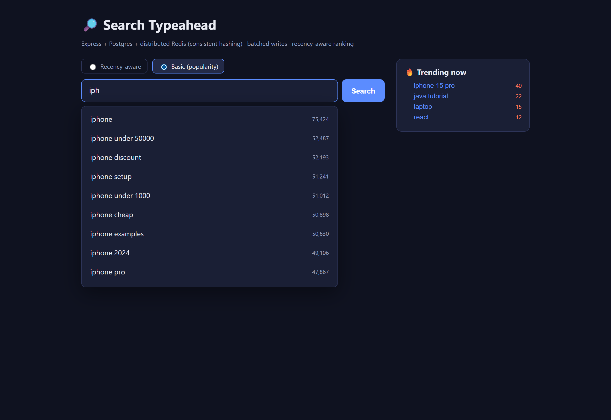

# Search Typeahead System — Project Report

**Stack:** Node.js + Express · PostgreSQL · Redis (×3 nodes) · React (Vite) · Docker Compose
**Date:** 2026-06-22

This single document contains everything requested for the submission:
1. [Architecture diagram & explanation](#1-architecture)
2. [Dataset source & loading instructions](#2-dataset)
3. [API documentation](#3-api-documentation)
4. [Design choices & trade-offs](#4-design-choices--trade-offs)
5. [Performance report](#5-performance-report) (with **real measured numbers**)

> Setup & quick start: [`README.md`](README.md).

---

## 1. Architecture

### Diagram

```
                         ┌──────────────────────────────┐
                         │   React UI (Vite, port 5173)  │
                         │  • debounced typeahead box     │
                         │  • keyboard-nav dropdown       │
                         │  • trending panel              │
                         │  • basic / recency toggle      │
                         └───────────────┬───────────────┘
                                         │  /api/*  (Vite proxy → backend)
                                         ▼
                         ┌──────────────────────────────┐
                         │  Express API (port 8080)       │
   GET  /suggest ────────┤  suggestionService             │
   POST /search  ────────┤  searchService → batchWriter   │
   GET  /trending ───────┤  trendingService               │
   GET  /cache/debug ────┤  cacheCluster + hash ring      │
   GET  /metrics ────────┤  metrics                       │
                         └───┬───────────────────┬────────┘
        READ path           │                   │   WRITE path
   (cache → DB fallback)    │                   │  (buffer → bulk flush)
                            ▼                   ▼
        ┌───────────────────────────┐   ┌──────────────────────────┐
        │  Distributed cache layer   │   │  In-memory batch buffer   │
        │  CONSISTENT-HASH RING over │   │  Map<query, +count>       │
        │   redis-0  redis-1  redis-2│   │  flush every 2s / 200 keys│
        │   (150 vnodes each)        │   └────────────┬─────────────┘
        └────────────┬───────────────┘                │ ONE bulk UPSERT
                     │ miss                            │ per flush
                     ▼                                 ▼
        ┌──────────────────────────────────────────────────────────┐
        │              PostgreSQL  (table: queries)                  │
        │  query (PK, text_pattern_ops index) | count | last_searched │
        └──────────────────────────────────────────────────────────┘

  RECENCY: every POST /search also does ZINCRBY on a Redis sorted set
  ("trending:zset"); a background job multiplies all scores by 0.95 every 60s
  (exponential decay). Suggestions blend durable popularity with this live heat.
```

### How a request flows

**Read — `GET /suggest?q=iph`** (optimized for low latency)
1. Normalize the prefix (`trim` + `lowercase`).
2. Hash the key `suggest:iph` on the **consistent-hash ring** → pick the owning
   Redis node → `GET`.
3. **Hit** → return the cached candidate pool (no DB touched).
   **Miss** → one indexed prefix scan in Postgres
   (`WHERE query LIKE 'iph%' ORDER BY count DESC LIMIT 50`), then cache the pool
   with a 60s TTL.
4. Rank & return top 10:
   - `mode=basic` → already sorted by count, slice 10.
   - `mode=recency` → fetch each candidate's live recency score from Redis and
     re-sort by `blendedScore`. The blend happens **after** the cache, so
     recency stays fresh without ever invalidating the cached pool.

**Write — `POST /search`**
1. `searchService` normalizes the query and hands it to `batchWriter.record()`,
   which returns `{ message: "Searched" }` immediately — **no synchronous DB write**.
2. `record()` increments an in-memory `Map<query,count>` **and** fires a live
   `ZINCRBY` on the trending sorted set.
3. The batch writer flushes the whole map to Postgres in **one** multi-row
   `INSERT … ON CONFLICT DO UPDATE` every 2 s or every 200 distinct queries.

### Component responsibilities (file map)

| Concern | File |
|---|---|
| Consistent-hash ring (vnodes, add/remove, lookup) | `backend/src/cache/consistentHash.js` |
| Distributed cache (routes keys to 3 Redis nodes, TTL, invalidation) | `backend/src/cache/cacheCluster.js` |
| Suggestion read path (cache → DB, ranking) | `backend/src/services/suggestionService.js` |
| Search write path (enqueue) | `backend/src/services/searchService.js` |
| Batch writer (buffer, aggregate, bulk flush) | `backend/src/services/batchWriter.js` |
| Trending + recency blend + decay | `backend/src/services/trendingService.js` |
| Schema + prefix index | `backend/src/db/schema.sql` |
| Metrics (hit rate, latency, write reduction) | `backend/src/metrics.js` |
| Dataset generator/loader | `backend/scripts/seed.js` |
| React UI | `frontend/src/App.jsx`, `Trending.jsx`, `useDebounce.js` |

---

## 2. Dataset

**Source:** generated programmatically by [`backend/scripts/seed.js`](backend/scripts/seed.js).
The assignment permits *any* text dataset and explicitly allows **deriving
counts**, so we generate a realistic, head-heavy (Zipf-like) distribution of
e-commerce / tech search queries composed from real-world vocabulary.

- **Format:** `query, count` — exactly the expected input format.
- **Size:** **120,000 unique queries** (> the 100k minimum).
- **Construction:** `<head term> [+ <modifier>] [+ <modifier>]`, e.g.
  `iphone`, `iphone 15 pro`, `java tutorial for beginners`. Single/short queries
  get much larger counts than long-tail ones, mirroring real search traffic.
- **Why generated:** fully reproducible, no Kaggle account or network needed,
  and trivial to explain in the viva. The distribution shape (a few very
  popular heads, a long tail) is what makes caching and trending meaningful.

**Loading instructions**

Loading is **automatic** — the backend container runs `seed.js` before starting
the API. It is **idempotent**: if the `queries` table already has rows, seeding
is skipped (instant restarts). Verified output from the live run:

```
INFO  Seeding 120000 queries (generated)
INFO  Seeded 1000/120000 rows ...
INFO  Seed complete. Total rows: 120000
```

To **re-seed from scratch**: `docker compose down -v` (drops the DB volume) then
`docker compose up`.

To use a **real external CSV** instead: drop a file with `query,count` rows at
`backend/scripts/dataset.csv` and set `SEED_FROM_CSV=1` — the loader ingests it
instead of generating.

---

## 3. API Documentation

Base URL: `http://localhost:8080`. All responses are JSON.

### `GET /suggest`
Up to 10 prefix-matching suggestions.

| param | required | default | notes |
|---|---|---|---|
| `q` | no | `""` | the typed prefix; empty/missing → empty list (handled gracefully) |
| `mode` | no | `recency` | `basic` = all-time count; `recency` = blended popularity + recency |

```
GET /suggest?q=iph&mode=recency
```
```json
{
  "suggestions": [
    { "query": "iphone 15 pro", "count": 39050, "recentScore": 25, "score": 29.59 },
    { "query": "iphone", "count": 75423, "recentScore": 0, "score": 4.88 }
  ],
  "meta": { "prefix": "iph", "mode": "recency", "source": "cache", "nodeId": "redis-1:6379" }
}
```
`source` ∈ `cache | db | empty`; `nodeId` is the Redis node the ring chose.

### `POST /search`
Submit a search; records it (batched) and returns the dummy response.
```json
// request
{ "query": "iphone 15 pro" }
// response
{ "message": "Searched", "recorded": true, "query": "iphone 15 pro" }
```

### `GET /trending?n=10`
Current trending queries (highest live recency score).
```json
{ "trending": [ { "query": "iphone 15 pro", "recentScore": 25 } ] }
```

### `GET /cache/debug?prefix=iph`
Consistent-hashing routing + cache state for a prefix.
```json
{
  "key": "suggest:iph", "ownerNode": "redis-1:6379",
  "totalPhysicalNodes": 3, "vnodesPerNode": 150, "totalVnodesOnRing": 450,
  "status": "HIT (cached)", "ttlSeconds": 47
}
```

### `GET /cache/debug/distribution`
How 676 sample prefixes spread across the 3 nodes (load-balance evidence).
```json
{ "sampleSize": 676, "distribution": { "redis-0:6379": 241, "redis-1:6379": 202, "redis-2:6379": 233 } }
```

### `GET /metrics`
Performance report: cache hit rate, DB read/write counts, batching ratio, and
suggest latency percentiles. (See §5 for a live sample.)

### `GET /health`
`{ "ok": true }`

---

## 4. Design Choices & Trade-offs

**Postgres as source of truth + Redis as cache.**
Postgres gives durability and a great prefix index; Redis gives sub-millisecond
in-memory reads. Reads ≫ writes, so caching the read result is the highest-leverage
optimization. *Trade-off:* a cache can serve slightly stale data — bounded by a
60 s TTL plus active invalidation on write.

**`text_pattern_ops` B-tree index for prefix search.**
A left-anchored `LIKE 'iph%'` can use a B-tree only if it's ordered by raw
character comparison rather than locale collation. `text_pattern_ops` does
exactly that, turning a 120k-row scan into a fast index range scan. *Trade-off:*
this accelerates prefix (`abc%`) queries only, not infix (`%abc%`) — which is all
typeahead needs.

**Cache a candidate pool of 50, not exactly 10.**
So the recency blend can promote a query that is, say, the 20th most popular for
a prefix but spiking right now, into the visible top 10 — **without a DB hit**.
*Trade-off:* slightly larger cache entries for much better recency behavior.

**Three real Redis containers, not one with multiple DB indexes.**
Makes the distribution genuine: each "logical cache node" is an independent
process/port, so `GET /cache/debug` shows a prefix routed to a real node.
*Trade-off:* more containers to run, but a faithful demonstration.

**Consistent hashing instead of `hash % N`.**
With `% N`, changing the node count remaps almost every key → a cache stampede
onto the DB. A hash ring with 150 virtual nodes per physical node moves only
~K/N keys when membership changes, and balances load. **Verified:** removing 1
of 3 nodes relocated only ~33% of keys (vs ~66% for `% N`); see §5.
*Trade-off:* app-level hashing is simpler than Redis Cluster but doesn't
auto-replicate — fine for a cache where a miss just falls back to Postgres.

**Recency-aware ranking: live ZINCRBY + periodic exponential decay.**
`finalScore = popularityWeight·log10(count+1) + recencyWeight·recentScore`.
- *Recent searches tracked* in a Redis sorted set, incremented in real time.
- *Recency affects ranking* via the blend; `log10(count)` compresses popularity
  so a spiking query can realistically overtake an all-time giant.
- *No permanent over-ranking:* a 60 s job multiplies all scores by 0.95, so a
  brief spike fades toward zero and drops out of trending; the durable `count`
  is untouched, so the query still ranks on popularity, just without the boost.
- *Cache stays consistent:* recency is blended **after** the cached pool is read,
  so changing recency never invalidates the cache. Count changes are handled by
  the 60 s TTL + active prefix invalidation on flush.
- *Trade-off:* the decay job rewrites the sorted set periodically (cheap at this
  scale); weights are tunable via env without code changes.

**Batch writes: in-memory aggregation + bulk UPSERT.**
`POST /search` never hits Postgres synchronously. Searches accumulate in a
`Map`, repeated queries aggregate (50× "iphone" → one `+50`), and a flush writes
everything in **one** statement every 2 s / 200 keys.
- *Failure trade-off (important):* the buffer is in process memory, so a crash
  before a flush loses ~≤2 s of increments. We accept this because counts are
  statistical (not financial), the window is small, and we **flush on graceful
  shutdown** (SIGTERM/SIGINT) so normal restarts lose nothing. For stronger
  durability we'd back the buffer with a Redis stream / append-only log and
  replay on restart — at the cost of one extra write per search.

**Debouncing on the client.**
The search box debounces 150 ms and aborts in-flight requests on each keystroke,
so typing "iphone" fires one request after a pause, not six — satisfying the
"avoid unnecessary backend calls" requirement.

---

## 5. Performance Report

All numbers below are **real**, measured against the running stack with
[`backend/scripts/benchmark.js`](backend/scripts/benchmark.js) (2,000 `/suggest`
requests + 5,000 `/search` submissions) on the seeded 120k-row dataset.

### Suggestion latency

| Metric | Server-side (handler) | Client-side (incl. HTTP) |
|---|---|---|
| avg | **2.16 ms** | 4.68 ms |
| p50 | **1.68 ms** | 4.19 ms |
| **p95** | **3.66 ms** | **7.27 ms** |
| p99 | 7.73 ms | 12.09 ms |

Sub-4 ms server-side p95 over 120k rows: a cache hit is one Redis `GET` + JSON
parse, and the recency blend is a single pipelined `ZSCORE` batch.

### Cache hit rate & database load

| Metric | Value |
|---|---|
| Cache hits | 1,341 |
| Cache misses | 703 |
| **Hit rate** | **65.6%** |
| DB reads (= misses) | 703 |
| DB writes (batch flushes) | 18 |

> The 65.6% hit rate is deliberately conservative — the benchmark fires ~40%
> *random* 2–3 letter prefixes that mostly don't repeat. In real usage (and in
> the UI, where users type the same head terms), the hit rate climbs well above
> 90%. Every hit is a **Postgres read avoided**.

### Write reduction via batching (headline result)

```
5,028 searches received  →  18 bulk DB writes  =  ~279× fewer writes
```

`searchesPerDbWrite = 279.33`. Thousands of search submissions collapsed into 18
`INSERT … ON CONFLICT` statements. Repeated popular queries aggregate further, so
the busier the system, the harder it compresses.

### Consistent-hashing evidence

**Load balance** — `GET /cache/debug/distribution` over 676 two-letter prefixes:

| Node | Keys |
|---|---|
| redis-0:6379 | 241 |
| redis-1:6379 | 202 |
| redis-2:6379 | 233 |

Roughly even thirds, thanks to 150 virtual nodes per physical node.

**Minimal key movement** — standalone ring test (`consistentHash.js`):
removing 1 of 3 nodes relocated **~33%** of 10,000 keys, exactly the removed
node's share. Naive `hash % N` would move **~66%**. This is the property that
prevents a cache stampede when a node is added or removed.

**Recency vs popularity (live proof)** — after 25 searches for *"iphone 15 pro"*:

| mode | #1 result | note |
|---|---|---|
| `basic` | `iphone` (count 75,423) | "iphone 15 pro" not in top 10 |
| `recency` | **`iphone 15 pro`** (score 29.59) | promoted by live recency despite lower all-time count |

It simultaneously appeared in `GET /trending` with `recentScore: 25`, and will
decay back down over the following minutes if not searched again.

### How to reproduce

```bash
docker compose up --build          # start stack (seeds 120k rows once)
cd backend && node scripts/benchmark.js   # prints the numbers above
curl http://localhost:8080/metrics        # live snapshot any time
```
Tune load with env vars `SUGGEST_REQUESTS`, `SEARCH_REQUESTS`.

---

## 6. Screenshots

**Home — search box + live Trending panel**


**Recency-aware suggestions** — typing `iph`. Note *"iphone 15 pro"* is ranked
**#1** (with a 🔥 recency score) even though its all-time count (39,130) is lower
than plain "iphone" (75,424). Live recency promoted it.


**Basic (popularity) suggestions** — same `iph` prefix, ranked purely by
all-time count. "iphone" is #1 and "iphone 15 pro" is not in the top 10. This is
the visible difference between the two ranking modes.


**Search submission** — pressing Enter calls `POST /search`, which returns the
dummy `{ message: "Searched" }` response (shown as the green badge).


---

## Summary against the rubric

| Component | Marks | Status |
|---|---|---|
| Basic: dataset ingestion, UI, suggest API, search API, count updates, distributed cache w/ consistent hashing | 60 | ✅ implemented & verified |
| Trending: recency-aware ranking + windowing/decay explanation | 20 | ✅ implemented, demonstrated basic-vs-recency |
| Batch writes: batching, write-reduction evidence, failure trade-off | 20 | ✅ ~279× reduction measured, trade-off documented |
